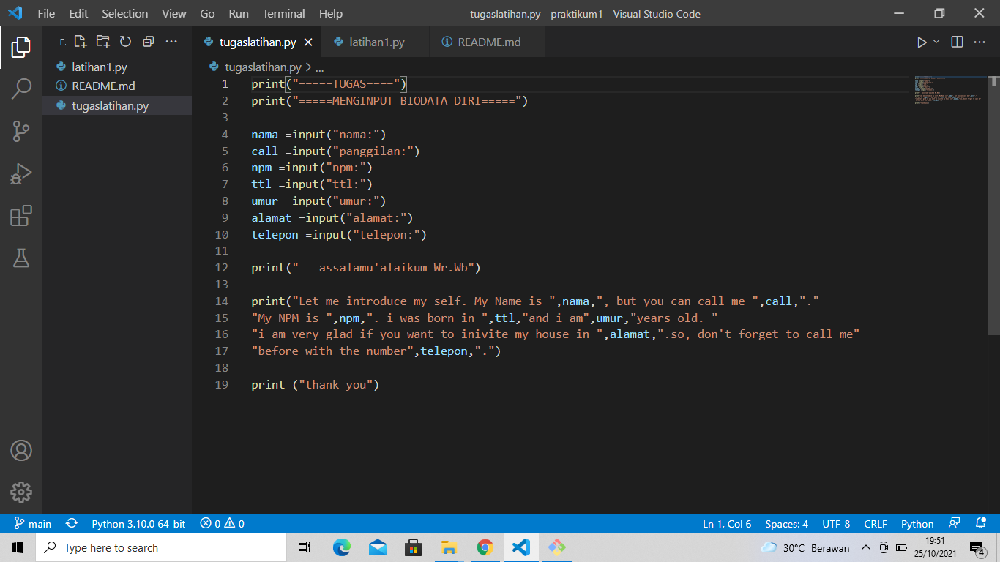
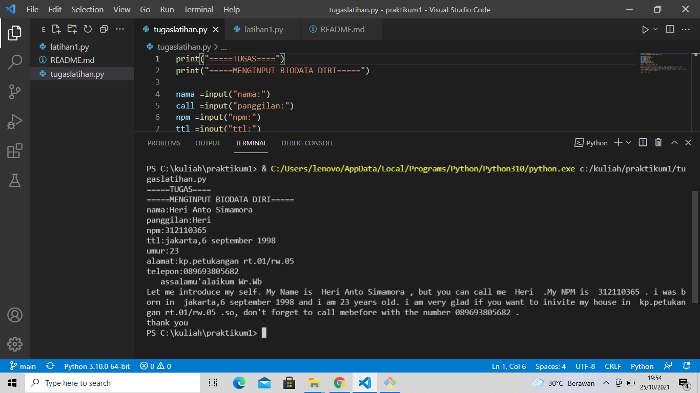

# Praktikum1
## Penjelasan Tentang Tugas Latihan1

### INPUT
print("=====TUGAS=====")

print("=====MENGINPUT BIODATA DIRI=====")

nama=input("nama:")

call=input("panggilan:")

npm=("npm:")

ttl=("ttl:")

umur=("umur:")

alamat=("alamat:")

telepon=("telepon:")

print(" assalamu'alaikum")

print("Let me introduce my self. My Name is ",nama,", but you can call me ",call,"."
"My NPM is ",npm,". i was born in ",ttl,"and i am",umur,"years old. "
"i am very glad if you want to inivite my house in ",alamat,".so, don't forget to call me"
"before with the number",telepon,".")

print("thank you")

seperti ini tampilanya

### OUTPUT
CONTOH DENGAN NAMA SAYA

=====TUGAS====

=====MENGINPUT BIODATA DIRI=====

nama:Heri Anto Simamora

panggilan:Heri

npm:312110365

ttl:jakarta,6 september 1998

umur:23

alamat:kp.petukangan rt.01/rw.05

telepon:089693805682

   assalamu'alaikum Wr.Wb

Let me introduce my self. My Name is  Heri Anto Simamora , but you can call me  Heri  .My NPM is  312110365 . i was born in  jakarta,6 september 1998 and i am 23 years old. i am very glad if you want to inivite my house in  kp.petukangan rt.01/rw.05 .so, don't forget to call mebefore with the number 089693805682 .

thank you

