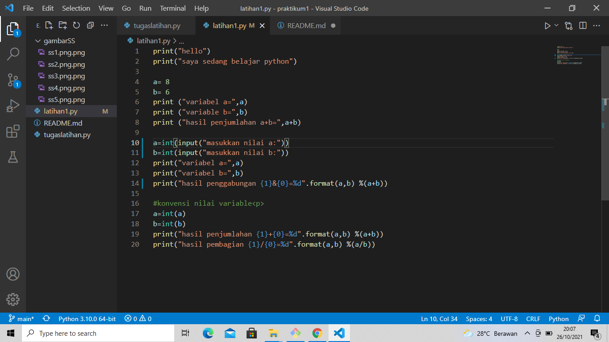

# Praktikum1
## Penjelasan Dari tugaslatihan1.py

### INPUT

beginilah proses cara menginput biodata diri menggunakan bahasa perograman pyhton yang kita buat

print("=====TUGAS=====")

print("=====MENGINPUT BIODATA DIRI=====")

nama=input("nama:")

call=input("panggilan:")

npm=("npm:")

ttl=("ttl:")

umur=("umur:")

alamat=("alamat:")

telepon=("telepon:")

print(" assalamu'alaikum")

print("Let me introduce my self. My Name is ",nama,", but you can call me ",call,"."
"My NPM is ",npm,". i was born in ",ttl,"and i am",umur,"years old. "
"i am very glad if you want to inivite my house in ",alamat,".so, don't forget to call me"
"before with the number",telepon,".")

print("thank you")

seperti ini tampilanya

### OUTPUT

inilah outputan dari proses inputan yang kita buat contoh menggunakan nama saya. teks yang muncul akan berisi dari inputan kita yang sudah kita isi juga

CONTOH DENGAN NAMA SAYA

=====TUGAS====

=====MENGINPUT BIODATA DIRI=====

nama:Heri Anto Simamora

panggilan:Heri

npm:312110365

ttl:jakarta,6 september 1998

umur:23

alamat:kp.petukangan rt.01/rw.05

telepon:089693805682

   assalamu'alaikum Wr.Wb

Let me introduce my self. My Name is  Heri Anto Simamora , but you can call me  Heri  .My NPM is  312110365 . i was born in  jakarta,6 september 1998 and i am 23 years old. i am very glad if you want to inivite my house in  kp.petukangan rt.01/rw.05 .so, don't forget to call mebefore with the number 089693805682 .

thank you

seperti ini tampilannya

## Penjelasan dari latihan1.py

### INPUT 

inilah inputan dari proses latihan1.py yang kita buat.kita harus memasukkan angka real pada (format(a,b) %(a+b)) di line ini "print("hasil penggabungan {1}&{0}=%d".format(a,b) %(a+b)" jika kita tidak mengubah variabel dengan angka real output akan error

print("hello")

print("saya sedang belajar python")

a= 8

b= 6

print ("variabel a=",a)

print ("variable b=",b)

print ("hasil penjumlahan a+b=",a+b)

a=input("masukkan nilai a:")

b=input("masukkan nilai b:")

print("variabel a=",a)

print("variabel b=",b)

print("hasil penggabungan {1}&{0}=%d".format(10,5) %(10+5))

#konvensi nilai variable

a=int(a)

b=int(b)

print("hasil penjumlahan {1}+{0}=%d".format(a,b) %(a+b))

print("hasil pembagian {1}/{0}=%d".format(a,b) %(a/b))

ini tampilannya

### OUTPUT

inilah output dari proses input yang kita buat. kita harus mengubah variabel (a) dan (b) pada (format(a,b) %(a+b)) di line ini "print("hasil penggabungan {1}&{0}=%d".format(a,b) %(a+b)" dengan angka real agar output akan dapat berjalan.

seperti berikut

hello

saya sedang belajar python

variabel a= 8

variable b= 6

hasil penjumlahan a+b= 14
 
masukkan nilai a:8

masukkan nilai b:4

variabel a= 8

variabel b= 4

hasil penggabungan 5&10=15

hasil penjumlahan 4+8=12

hasil pembagian 4/8=2

output sebagai berikut jika kita masukkan nilai pada variabel a=8 dan variabel b=4 akan muncul 
hasil pemjumlahan sebagai berikut (hasil pengabungan 5&10),(hasil penjumlahan 4+8=12),(hasil pembagian 4/8=2) 

! [gambar5](gambarSS/ss5.png.png)